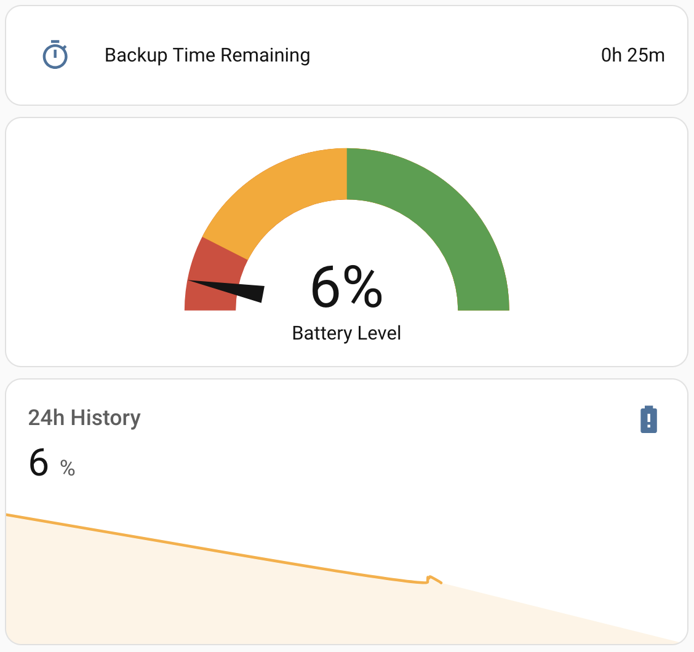
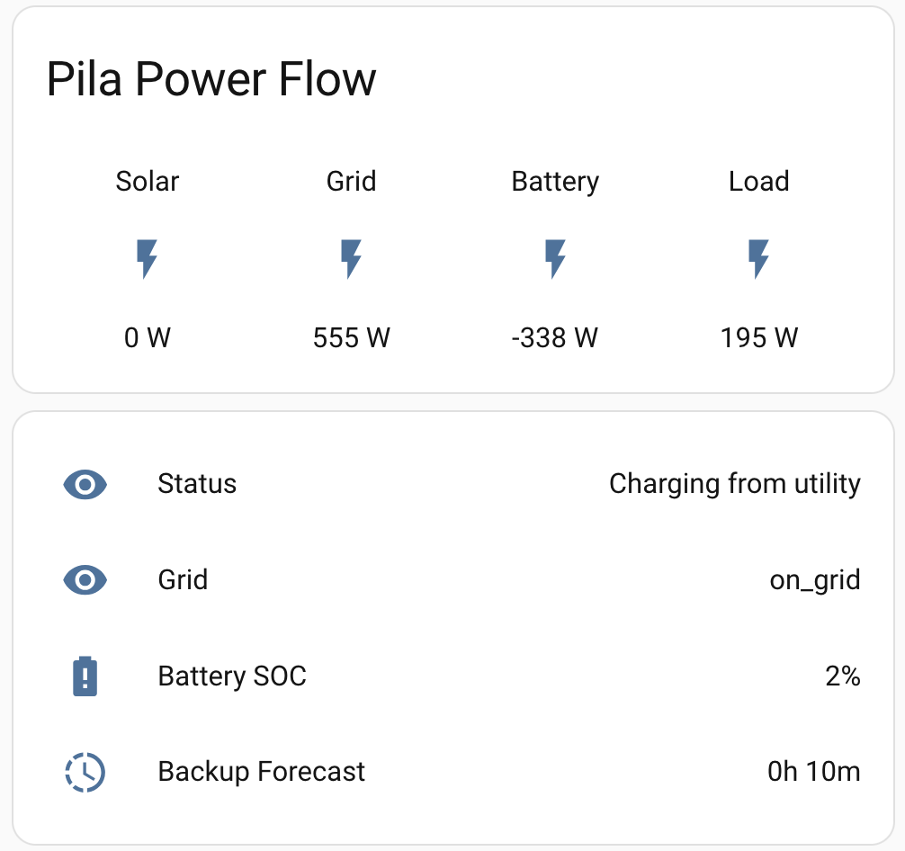
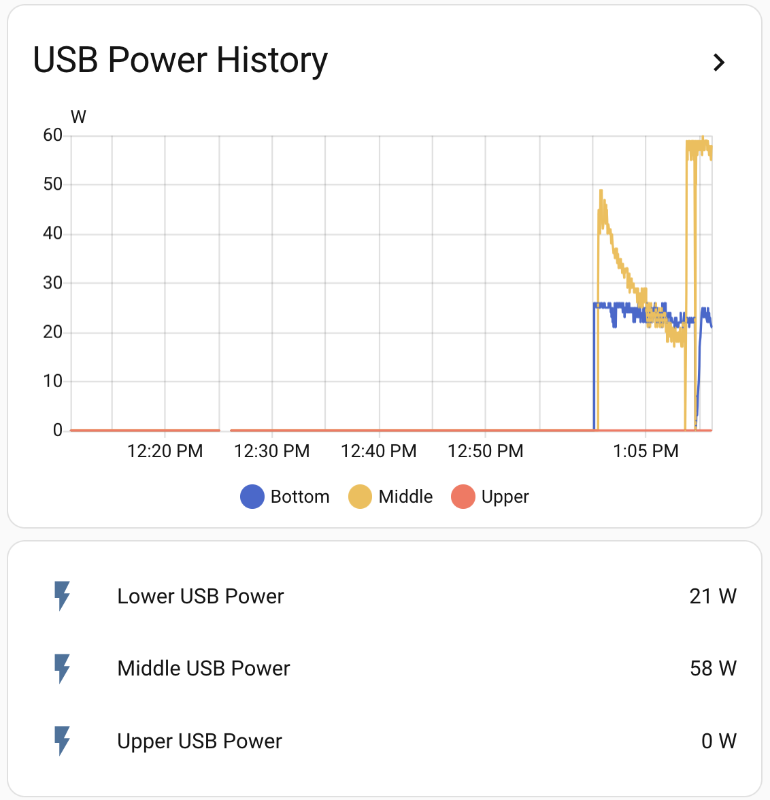

# Pila + Home Assistant

Monitor and control your [Pila](https://pilaenergy.com) battery from [Home Assistant](https://www.home-assistant.io/) over MQTT.

## Contents

- [Compatibility](#compatibility)
- [Setup](#setup)
- [Entities](#entities)
- [Home Assistant Energy Dashboard](#home-assistant-energy-dashboard)
- [Example Lovelace cards](#example-lovelace-cards)
- [Example automations](#example-automations)
- [Troubleshooting](#troubleshooting)
- [Advanced: MQTT topics](#advanced-mqtt-topics)
- [Changelog](./CHANGELOG.md)

## Compatibility

| Requirement | Notes |
|---|---|
| Pila firmware | 1.1 or newer |
| Home Assistant | 2024.x or newer (MQTT discovery v2 schema) |
| MQTT broker | Any MQTT 3.1.1 broker. Mosquitto add-on recommended. |
| Network | Pila and Home Assistant must be on the same local network |
| TLS | Plaintext on port 1883 only today. TLS support is planned. |

## Setup

Total time: about 5 minutes.

### 1. Install an MQTT broker in Home Assistant

If you already have one, skip to step 2. For deeper detail, see [Home Assistant's MQTT integration docs](https://www.home-assistant.io/integrations/mqtt).

1. **Settings → Add-ons → Add-on Store**
2. Install **Mosquitto broker**
3. Start the add-on; enable "Start on boot" and "Watchdog"
4. **Settings → Devices & services → Add Integration → MQTT**. Home Assistant auto-detects the broker.


### 2. Connect on the Pila screen

On your Pila:

1. Open **Settings → Home Assistant**
2. The **IP Address** field is pre-populated — Pila does an mDNS sweep for `homeassistant.local` on boot and fills in what it finds. If the address looks right, use it. Otherwise, find it manually in HA under **Settings → System → Network** and overwrite.

   

3. Enter your Home Assistant username and password
4. Tap **Save & Connect**


The status indicator turns green when connected. The connection persists across reboots.

> 💡 **Optional: dedicated HA user.** For tighter security, create a non-admin HA user just for Pila (**Settings → People → Users → Add User**) and use those credentials in step 3. Your normal credentials work fine otherwise.

### 3. Verify

In Home Assistant, **Settings → Devices & services → MQTT** should show your Pila with all entities listed below.

## Entities

Home Assistant generates entity IDs from your Pila's **device name**. If your Pila is called *Kitchen Pila*, entities show up as `sensor.kitchen_pila_battery_soc`, `switch.kitchen_pila_back_lower_outlet`, and so on. The examples below use `your_pila` as a placeholder — replace it with your Pila's slug.

> ⚠️ **The slug is sticky.** Home Assistant bakes your Pila's name into entity IDs the first time it connects. If you rename the Pila later in the app, the friendly name updates in HA but the entity IDs stay the same. The fastest fix: in HA, go to **Settings → Devices & services → MQTT → your Pila**, open the **⋮ menu**, and choose **Recreate entity IDs**. HA will regenerate every entity_id from the current device name in one click (requires HA 2025.6 or newer).

### Power (instantaneous)

| Name | Unit | Description |
|---|---|---|
| Total Usage | W | Total load currently being powered by the Pila (battery + grid + solar combined). |
| Battery Charge / Discharge Rate | W | Signed power into/out of the battery pack. Positive = charging, negative = discharging. |
| Total Solar Input | W | Power currently arriving from solar. |
| Total AC Input | W | Power currently flowing in from the grid. |

### Battery

| Name | Unit | Description |
|---|---|---|
| Battery SOC | % | State of charge, 0–100. |
| Battery energy remaining | Wh | Energy left in the pack at the current state of charge. |
| Backup Forecast | h | Estimated hours of backup runtime at current load. |
| Pila Status | — | Human-readable summary. One of: `Solar powering devices`, `Battery powering devices`, `Charging from solar`, `Charging from utility`, `Utility powering devices`, `Idle`. |

### Grid

| Name | Unit | Description |
|---|---|---|
| Grid Status | — | One of: `on_grid` (connected to and using utility), `off_grid` (islanded — running on battery/solar), `idle_off_grid` (no grid and no AC output), `unknown`. |

### Lifetime energy totals

Cumulative `total_increasing` counters designed for the Energy Dashboard.

| Name | Unit | Description |
|---|---|---|
| Pila Lifetime Import | Wh | Total energy imported from the grid through Pila over the device's lifetime. |
| Battery Lifetime Charge | Wh | Total energy charged into the battery pack over its lifetime. |
| Battery Lifetime Discharge | Wh | Total energy discharged from the battery pack over its lifetime. |

### Per-outlet (one set per outlet)

For each AC and USB-C outlet:

| Entity | Type | Unit | Description |
|---|---|---|---|
| `{outlet name}` | switch | — | Turn the outlet on or off. State reflects relay state. |
| `{outlet name} power` | sensor | W | Power currently flowing through the outlet. |
| `{outlet name} Lifetime Energy` | sensor | Wh | Cumulative energy delivered through the outlet. |

**Outlet naming.** If you've assigned an appliance name to an outlet in the Pila app (e.g. "Fridge"), Home Assistant uses that name. Otherwise it falls back to the orientation default ("Left USB Port", "Middle USB Port", "Right USB Port", "Front Left Outlet", "Front Right Outlet", "Back Upper Outlet", "Back Lower Outlet", etc.). The slug is derived from this name, so a default `usb_1` becomes `sensor.your_pila_right_usb_port_power`, not `sensor.your_pila_usb_1_power`. Confirm the exact entity_id in **Settings → Devices & services → MQTT → your Pila** before referencing it in YAML.

Renaming an outlet in the Pila app updates the friendly name in HA but **does not change the entity_id**. Use the device's **⋮ → Recreate entity IDs** menu in HA (2025.6+) to regenerate them.

### Controls

| Name | Type | Values | Description |
|---|---|---|---|
| Grid mode | select | `on_grid`, `off_grid` | Switch Pila between on-grid and manual off-grid (island) mode. |

## Home Assistant Energy Dashboard

Wire Pila into [Settings → Dashboards → Energy](https://www.home-assistant.io/docs/energy/):

| Energy Dashboard tile | Pila entity |
|---|---|
| Grid consumption | Pila Lifetime Import |
| Battery in (charge) | Battery Lifetime Charge |
| Battery out (discharge) | Battery Lifetime Discharge |

The Energy Dashboard uses cumulative counters, not instantaneous power. Don't wire `Battery Charge / Discharge Rate` here.

## Example Lovelace cards

Drop these into a dashboard via **Edit dashboard → Add card → Manual**. Replace `your_pila` in entity IDs with your Pila's slug (e.g. `kitchen_pila`).

### Battery SOC dial with backup forecast



```yaml
type: vertical-stack
cards:
  - type: entities
    entities:
      - entity: sensor.your_pila_backup_forecast
        name: Backup Time Remaining
        icon: mdi:timer-outline
  - type: gauge
    entity: sensor.your_pila_battery_soc
    name: Battery Level
    needle: true
    severity:
      green: 50
      yellow: 15
      red: 0
  - type: sensor
    entity: sensor.your_pila_battery_soc
    graph: line
    name: 24h History
    detail: 2
    hours_to_show: 24
```

[`examples/dashboards/battery-soc-card.yaml`](./examples/dashboards/battery-soc-card.yaml)

### Power flow overview



```yaml
type: vertical-stack
cards:
  - type: glance
    title: Pila Power Flow
    columns: 4
    entities:
      - entity: sensor.your_pila_total_solar_input
        name: Solar
      - entity: sensor.your_pila_total_ac_input
        name: Grid
      - entity: sensor.your_pila_battery_charge_discharge_rate
        name: Battery
      - entity: sensor.your_pila_total_usage
        name: Load
  - type: entities
    entities:
      - entity: sensor.your_pila_pila_status
        name: Status
      - entity: sensor.your_pila_grid_status
        name: Grid
      - entity: sensor.your_pila_battery_soc
        name: Battery SOC
      - entity: sensor.your_pila_backup_forecast
        name: Backup Forecast
```

[`examples/dashboards/power-flow-overview.yaml`](./examples/dashboards/power-flow-overview.yaml)

### USB-C stacked history



```yaml
type: vertical-stack
cards:
  - type: history-graph
    title: USB Power History
    hours_to_show: 1
    entities:
      - entity: sensor.your_pila_left_usb_port_power
        name: Left
      - entity: sensor.your_pila_middle_usb_port_power
        name: Middle
      - entity: sensor.your_pila_right_usb_port_power
        name: Right
  - type: entities
    entities:
      - entity: sensor.your_pila_left_usb_port_power
        name: Left USB Power
      - entity: sensor.your_pila_middle_usb_port_power
        name: Middle USB Power
      - entity: sensor.your_pila_right_usb_port_power
        name: Right USB Power
```

[`examples/dashboards/usb-power-history.yaml`](./examples/dashboards/usb-power-history.yaml)

## Example automations

Paste into **Settings → Automations → Add → Edit in YAML**.

### Low-SOC notification

```yaml
alias: Pila low battery notification
trigger:
  - platform: numeric_state
    entity_id: sensor.your_pila_battery_soc
    below: 20
    for:
      minutes: 1
action:
  - service: notify.notify
    data:
      title: Pila battery low
      message: >
        Pila is at {{ states('sensor.your_pila_battery_soc') }}%.
        Estimated {{ states('sensor.your_pila_backup_forecast') }} hours of backup remaining.
mode: single
```

[`examples/automations/low-soc-notification.yaml`](./examples/automations/low-soc-notification.yaml)

### Grid outage notification

```yaml
alias: Pila grid outage notification
trigger:
  - platform: state
    entity_id: sensor.your_pila_grid_status
    to: off_grid
action:
  - service: notify.notify
    data:
      title: Pila is off-grid
      message: >
        Pila switched to off-grid mode. Currently {{ states('sensor.your_pila_pila_status') | lower }}.
        Battery at {{ states('sensor.your_pila_battery_soc') }}%.
mode: single
```

[`examples/automations/grid-outage-notification.yaml`](./examples/automations/grid-outage-notification.yaml)

### Shed non-essential load on low battery

Turn off a non-essential outlet when battery drops below 30 % during a grid outage.

```yaml
alias: Pila shed non-essential load on low battery
trigger:
  - platform: numeric_state
    entity_id: sensor.your_pila_battery_soc
    below: 30
condition:
  - condition: state
    entity_id: sensor.your_pila_grid_status
    state: off_grid
action:
  - service: switch.turn_off
    target:
      entity_id: switch.your_pila_front_right_outlet
mode: single
```

[`examples/automations/turn-off-outlet-on-low-soc.yaml`](./examples/automations/turn-off-outlet-on-low-soc.yaml)

## Troubleshooting

**Status stuck on "Disconnected" on the Pila screen.** Check that (a) the HA IP is correct and stable (set a DHCP reservation if needed), (b) the username/password work in a browser, (c) the Mosquitto add-on is running, and (d) port 1883 is reachable from the local network (`nc -vz <HA_IP> 1883`). Reboot Pila and watch the indicator.

**Pila is connected but no entities appear.** In Home Assistant: **Settings → Devices & services → MQTT → Configure → Listen to a topic**, subscribe to `homeassistant/device/pila/#`. You should see a config payload shortly after Pila connects. If you see the payload but no device, restart HA once — discovery occasionally fails to register on first push.

**Entities show "Unknown" or "Unavailable" forever.** Subscribe to `pila/state/#` to confirm state messages are flowing. If they are, the value template may not be finding the key — [open an issue](https://github.com/PilaEnergy/pila-home-assistant/issues) with the raw payload.

**Outlet switch doesn't change state when I toggle it.** Relay commands are fire-and-forget; state reflects what Pila reports back. Give it 2–3 seconds. If it never changes, check whether a Pila-side schedule or timer is fighting your command.

**Disconnecting from Home Assistant.** Tap **Disconnect** on the Pila Home Assistant screen. The MQTT device goes offline in HA; the entities remain in HA's registry until you delete the device manually under **Settings → Devices & services → MQTT**.

For anything else, [open an issue](https://github.com/PilaEnergy/pila-home-assistant/issues) with your Pila firmware version, Home Assistant version, broker, and what you've tried.

## Advanced: MQTT topics

For users who want to bypass HA discovery and consume topics directly.

| Purpose | Topic |
|---|---|
| Discovery config (published by Pila) | `homeassistant/device/pila/{device_id}/config` |
| State (published by Pila) | `pila/state/{device_id}` |
| Commands (subscribed by Pila) | `pila/command/{device_id}` |

State messages are published at QoS 2. Retained messages are used for connection-status only. The discovery config is re-published on every reconnect, so deleting the device in HA and reconnecting Pila will recreate it.

## License

See [LICENSE](./LICENSE).
