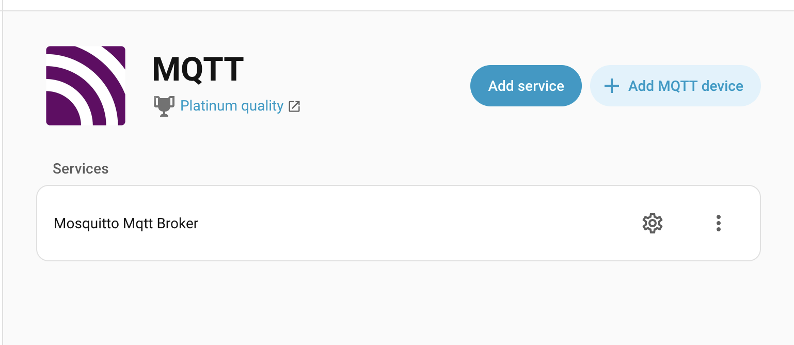
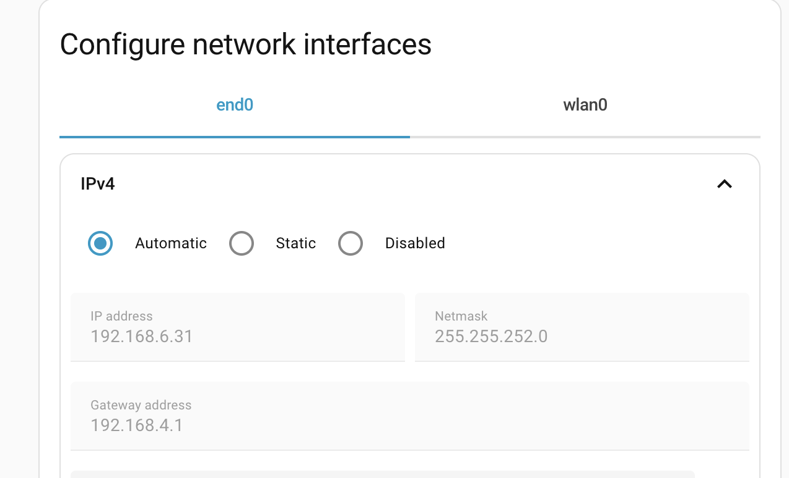
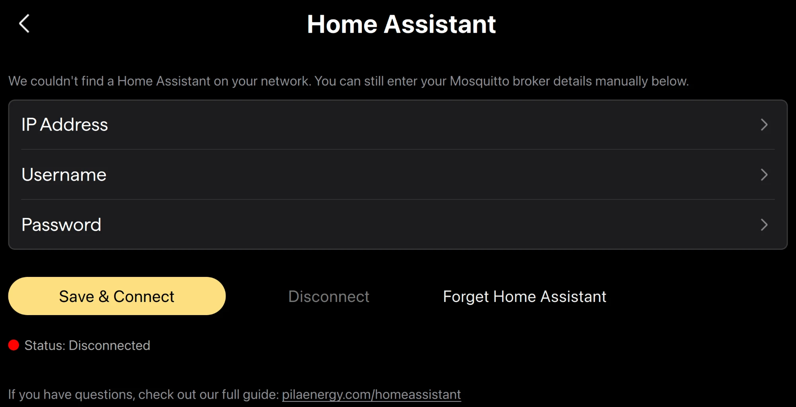

# Setup

Connecting Pila to Home Assistant is a four-step process. Total time: about 5 minutes.

## Prerequisites

- A running Home Assistant instance (HAOS, Supervised, or Container — any flavor with the Mosquitto add-on or another MQTT broker)
- Your Pila on the same local network as Home Assistant
- Pila firmware vTODO or newer

## 1. Install and configure an MQTT broker in Home Assistant

If you already have an MQTT broker set up, skip to step 2.

In Home Assistant:

1. Go to **Settings → Add-ons → Add-on Store**
2. Install **Mosquitto broker**
3. Start the add-on. Enable "Start on boot" and "Watchdog"
4. Go to **Settings → Devices & services**, click **Add Integration**, and choose **MQTT**. Home Assistant should auto-detect the broker.

 <!-- TODO -->

## 2. Find your Home Assistant IP address

In Home Assistant:

1. Go to **Settings → System → Network**
2. Note the IP address of the interface Pila will connect over (usually `eth0` / `end0` or `wlan0`)

 <!-- TODO -->

In the example below, the IP is `192.168.6.31`.

## 3. Create a Home Assistant user for Pila

We recommend creating a dedicated Home Assistant user for Pila so credentials are easy to rotate.

1. Go to **Settings → People → Users → Add User**
2. Set a username (e.g. `pila`) and password
3. **Do not** make the user an administrator

## 4. Enter broker details on your Pila

On your Pila's screen:

1. Open the **Settings → Home Assistant** screen
2. Enter the Home Assistant IP address, the username, and the password from step 3
3. Tap **Save & Connect**

 <!-- TODO -->

The status indicator will turn green when connected. The connection persists across reboots.

## 5. Verify in Home Assistant

In Home Assistant, go to **Settings → Devices & services → MQTT**. You should see your Pila listed as a device with all of its [entities](./entities.md).

## What's next

- [Wire Pila into the Energy Dashboard](./energy-dashboard.md)
- [Try the example dashboards](../examples/dashboards/)
- [Set up your first automation](../examples/automations/)
